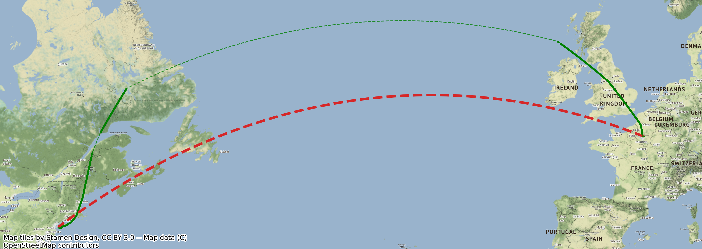
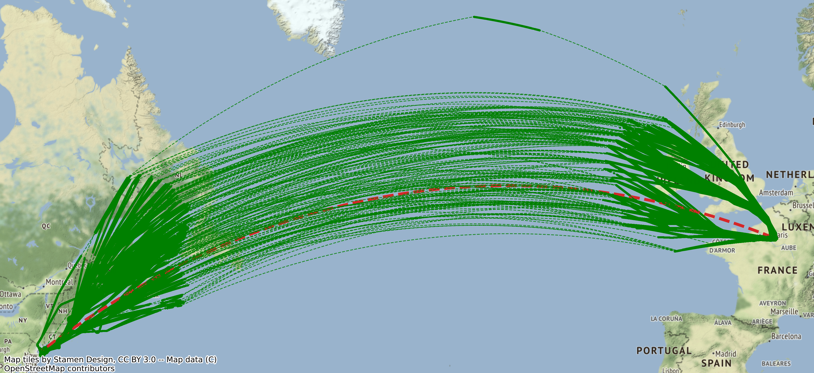
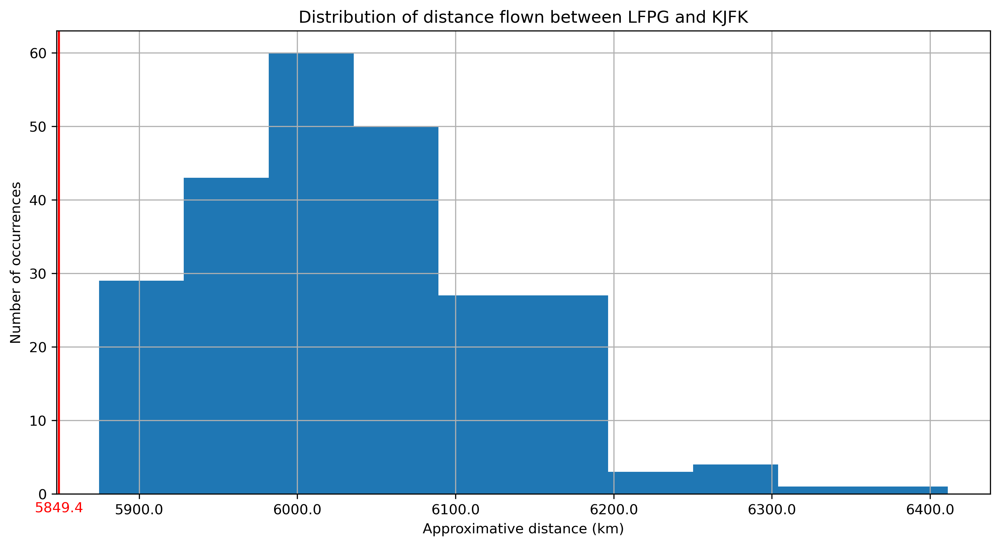

# Visualize and estimate extra distance of transatlantic flights compared to orthodromic distance

Aircraft trajectories differ from great circle trajectories, corresponding to shortest paths from one point to another.
In particular, transatlantic flights are optimized based on the force and the direction of the winds.
The objective of this Python code is to use position reports from ADS-B data collected and shared by the [OpenSky Network](https://opensky-network.org/) to visualize and evaluate the extra distance of a set of transatlantic flights (from Paris to New York).

In the following figure, you can visualize in red the great circle between the two airports (LFPG and KJFK) and in green the real trajectory of flight AFR006. The part in dashed lines is an interpolation between positions, 
based on a orthodromic projection.

We can visualize all the flights from LFPG to KJFK during a month to illustrate the dispersion of trajectories.

We finally evaluate the real distance flown with the[Python traffic library](https://traffic-viz.github.io/)
and visualize the distribution of these distances compared to the orthodromic distance.

## Running the tests

Run the Python notebook LFPG_KJFK.ipynb to load data and visualize flight data on maps.

## Built With

The following Python libraries are used in these notebooks:
* [traffic](https://traffic-viz.github.io/) - Air traffic data processing with Python
* [GeoPandas](https://geopandas.org/en/stable/) - GeoPandas is an open source project which extends the datatypes used by pandas to allow spatial operations on geometric types.
* [contextily](https://github.com/darribas/contextily) - Context geo-tiles in Python

## Versions

This code was tested with following versions:
* Python 3.10.9, traffic 2.8.1, geopandas 0.12.2, contextily 1.3.0

## Authors

* **Thomas Dubot** 

## License

This project is licensed under the MIT License - see the [LICENSE.md](LICENSE.md) file for details

## Acknowledgments
Thanks to the OpenSky Network community to share and provide access to ADS-B data.

